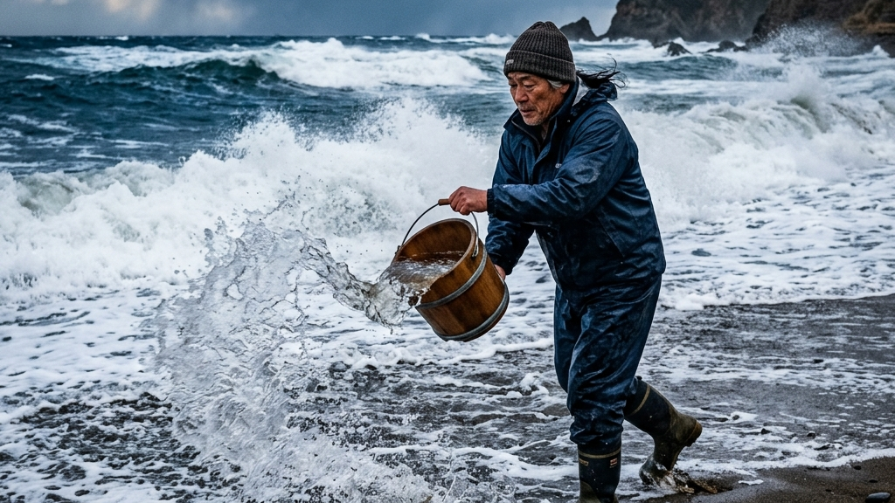
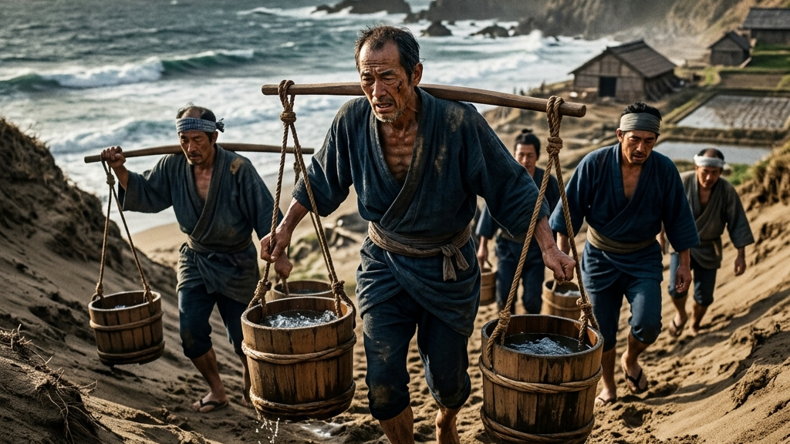
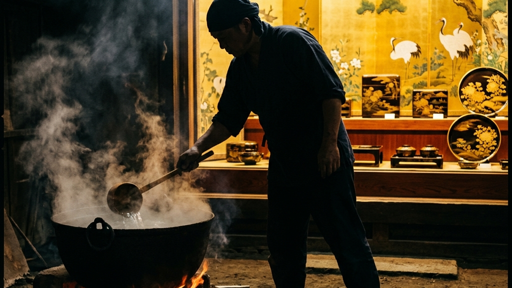
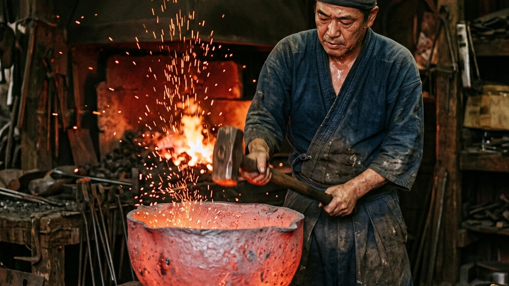
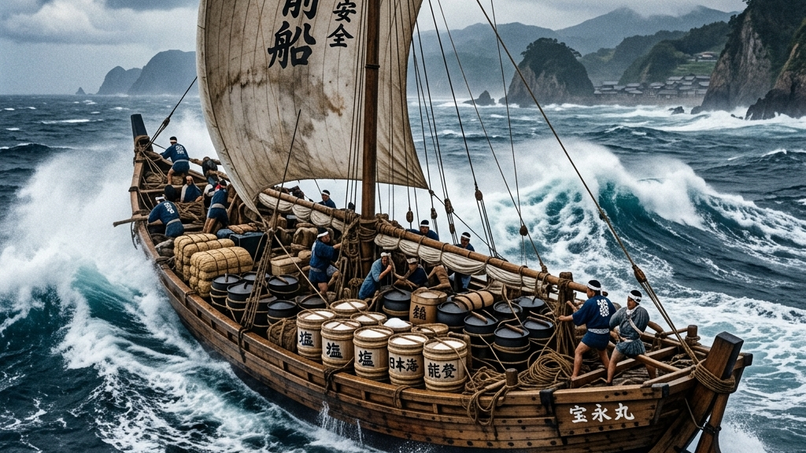
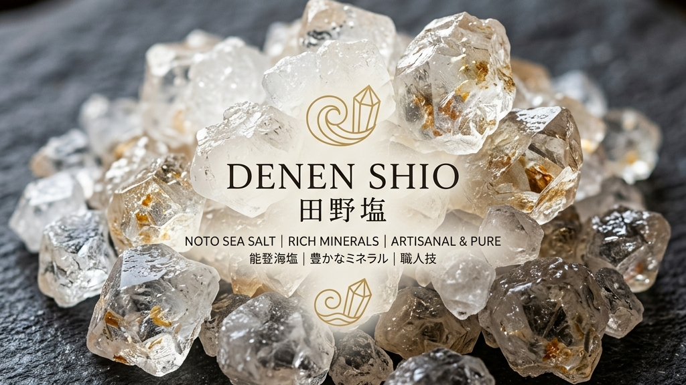
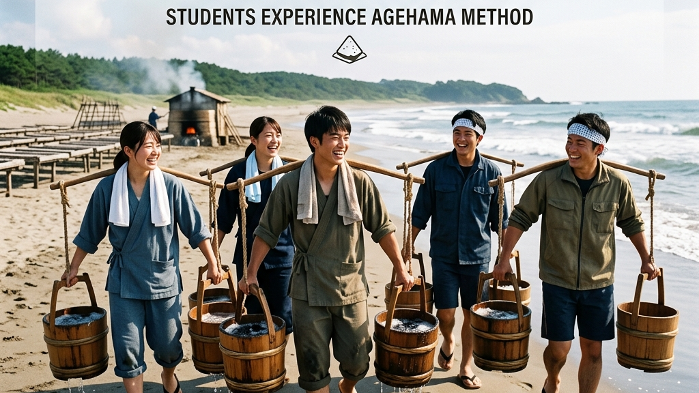
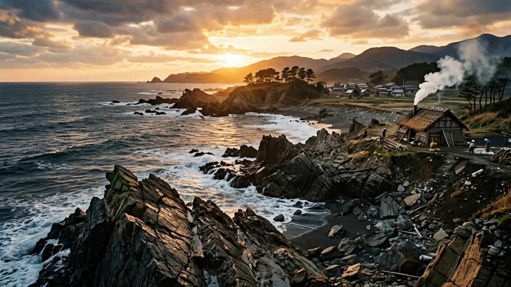

<figure class="wp-block-image"></figure>

能登半島の最北端、日本海の荒波が打ち寄せる珠洲の海岸線には、一見すると不毛な砂の海が広がっています。しかし、そこには世界でも稀有な、人間と自然が血みどろの闘いを繰り広げてきた痕跡が刻まれています。  約500年以上もの間、日本で唯一この能登という極限の土地にのみ生き残り、奇跡的に現在まで受け継がれている「揚げ浜式製塩」。それは単なる塩作りの古い技術などではありません。非効率の極みとも言える途方もない肉体労働を強いられた農民たちの生存戦略であり、加賀藩「百万石」という強大な重力に抗い、あるいは取り込まれながら生き抜いた「土着のエコシステム」の結晶です。本稿では、効率化の果てに私たちが失ってしまった「手触りのある労働」の真価を、能登の塩と中居鋳物が織りなす圧倒的な歴史のアーカイブから解剖します。

<h2>揚げ浜式製塩が強いた極限の生存戦略と年貢システム</h2>
<figure class="wp-block-image"></figure>

「塩」は、現代の私たちにとってはスーパーの棚で数百円で手に入る、最もコモディティ化された調味料に過ぎません。しかし、江戸時代の能登半島において、塩は「命」そのものであり、同時に「過酷な税（年貢）」という呪縛でもありました。揚げ浜式製塩という手法は、人間が自然の猛威に直接立ち向かい、自らの身体をすり減らして結晶を抽出する、極限の生存戦略の産物だったのです。

<h3>「塩納」がもたらした加賀藩百万石の影の財源</h3>

能登半島は、その大部分を急峻な山林が占め、平野部が極端に少ないという致命的な地理的条件を抱えていました。稲作に適した土地が圧倒的に不足しているこの地域では、加賀藩から課せられる過酷な「米の年貢」を納めることは物理的に不可能でした。そこで、能登の人々が生き残るために選んだ（あるいは強制された）唯一の手段が、目の前に広がる無尽蔵の海水を煮詰め、それを米の代わりに納める「塩納（えんのう）」という制度でした。

加賀藩は、この能登の製塩業を「米に代わる巨大な財源」として徹底的に管理・庇護しました。当時、塩は保存食の要であり、内陸部においては黄金にも匹敵する価値を持つ戦略物資でした。藩は「塩手米（しおてまい）」という制度を設け、製塩の燃料となる薪や、生活に必要な米を製塩業者に前貸しする代わりに、生産された塩をすべて買い上げるという、一種の巨大な国家独占資本主義（専売制）を敷きました。

この強固な保護と搾取のハイブリッド・システムによって、能登の揚げ浜式製塩は爆発的な発展を遂げます。最も盛んだった時代には、能登沿岸に無数の塩田が立ち並び、そこから生産された塩は北前船に乗せられ、遠く蝦夷地（北海道）や上方へと流通し、加賀藩百万石の豪奢な文化を裏から支える巨大な経済の血液となったのです。

<h2>加賀百万石の文化戦略と、それを裏で支えた製塩の血脈</h2>
<figure class="wp-block-image"></figure>

前田利家から始まる加賀藩「百万石」は、徳川幕府（江戸幕府）から常に警戒される外様大名としての宿命を背負っていました。彼らは幕府からの猜疑心を逸らすため、あえて武力を誇示することを避け、茶の湯や能楽、金箔や漆器といった「工芸・文化」へ莫大な投資を行うことで、自らの大名としての権威を洗練された形でアピールするという極めて高度な生存戦略（文化政治）をとりました。現在まで続く「美術工芸の街・金沢」の礎は、この江戸時代の生き残り戦略によって築かれたものです。

<h3>華やかな文化を根底で支えた「泥臭い外貨獲得」</h3>

しかし、きらびやかな金箔や繊細な九谷焼、そして武士たちが嗜む茶の湯の文化は、ただ待っていれば天から降ってくるものではありません。それらを育成し、文化大国としてのステータスを維持するためには、裏側で莫大な「外貨（現金）」を稼ぎ出す必要がありました。そしてその外貨獲得の最前線に立たされていたのが、華やかな城下町からは遠く離れた、能登半島のどん詰まりで重い海水を担ぐ製塩業者たちだったのです。

加賀藩の文化戦略は、能登の塩や木材といった一次産業の徹底的な管理と専売制によって生み出された巨大な利益の上に成り立っていました。言わば、金沢の美しい伝統工芸の影には、能登の荒波の中で塩の結晶を削り出した職人たちの血と汗が染み込んでいるのです。この「華やかな文化（美学）」と「極限の肉体労働（泥臭さ）」という強烈なコントラストこそが、加賀百万石という巨大なシステムの真の姿であり、能登の塩業が単なる地方産業以上の意味を持つ理由でもあります。

<h3>数千リットルの海水と闘う「狂気の重労働」</h3>

しかし、その経済システムの末端で塩を作り出す作業は、現代の想像を絶する「狂気の重労働」でした。揚げ浜式製塩のプロセスは、まず早朝、職人が「打桶（うちおけ）」と呼ばれる巨大な桶を天秤棒で担ぎ、冷たい日本海へ歩き出すところから始まります。一つの桶に入る海水は約30〜40キロ。それを両肩に担ぎ、波打ち際から塩田まで急勾配の砂浜を何十往復、何百往復と行き来しなければなりません。

    

        ◆
        <strong style="display: block; font-size: 1em; margin-bottom: 0.2em; color: #333;">潮汲みと潮撒き</strong>
        
汲み上げた約6,000リットルもの海水を、霧のように均等に砂丘（塩田）へ撒き散らす。砂の表面で水分を太陽と風によって蒸発させ、塩分を砂に付着させる。

    

    

        ◆
        <strong style="display: block; font-size: 1em; margin-bottom: 0.2em; color: #333;">かん水の抽出（垂船）</strong>
        
塩分が付着した砂を集め、「垂船（たれぶね）」と呼ばれる木箱に入れ、さらに海水をかけて極めて濃度の高い塩水（かん水）を抽出する。

    

    

        ◆
        <strong style="display: block; font-size: 1em; margin-bottom: 0.2em; color: #333;">荒煎りと本煎り（釜焚き）</strong>
        
かん水を巨大な鉄釜に移し、灼熱の火の粉を浴びながら15時間以上休むことなく煮詰める。わずかな火加減のミスが焦げを生み、すべてを台無しにする。

    

この気の遠くなるようなプロセスを経て、6,000リットルの海水から採れる塩は、わずか100キログラム程度に過ぎません。さらに恐ろしいのは、これがすべて「天候」という完全にコントロール不能な自然に依存しているという事実です。突然の雨が降れば、砂に付着した塩分はすべて流され、数日間の血を吐くような労働が文字通り「一瞬で水の泡」となります。彼らは、自然の理不尽さを恨むことすら許されず、ただ黙々と、明日もまた重い桶を担いで海へ向かうしかなかったのです。それは、人間が自然を支配するのではなく、自然の圧倒的な暴力の前にひれ伏し、その隙間を縫って生き延びるという、泥臭い自然受容の極致でした。

<h2>中居鋳物と塩釜が結んだ血の通う循環型エコシステム</h2>
<figure class="wp-block-image"></figure>

揚げ浜式製塩という過酷な労働を物理的、そして化学的に支えていたのは、最終工程でかん水（濃縮された塩水）を煮詰めるための巨大な「塩釜」でした。そして、この塩釜の供給を一手に担い、能登の塩業全体を下支えしていたのが、能登半島の内海に面した穴水町中居地区で発展した「中居鋳物（なかいいもの）」です。

<h3>塩釜製造に特化した特異な鋳物産業の系譜</h3>

国立民族学博物館の日高真吾教授らの詳細な調査によれば、中居地区の鋳物産業は、単なる日用品の生産拠点ではなく、珠洲の塩田で絶対的に必要とされる「塩釜の需要」と極めて密接に結びついて発展・肥大化しました。卓越した技術を持つ中居の鋳物師の中には、加賀藩主のお抱え職人として取り立てられ、特別な特権を付与される者も存在し、その技術力は能登半島という局所的な枠を大きく越えて、北前船のネットワークを通じて全国へとその名を轟かせていました。

<dl style="margin: 2em 0; border-top: 2px solid #111;">
    <dt style="font-weight: bold; font-size: 1.1em; margin-top: 1.5em; color: #111;">中居鋳物（なかいいもの）</dt>
    <dd style="margin: 0.5em 0 1.5em 0; padding-left: 1.5em; border-left: 2px solid #bba078; color: #555;">石川県鳳珠郡穴水町中居地区で生産された鋳物の総称。古くは室町時代に起源を持ち、加賀藩の強力な庇護のもと、主に能登の製塩業に不可欠な塩釜や、鍋、釜、農具などの鉄製品を大量に生産した特異な産業拠点。</dd>
</dl>

かん水を煮詰めるという行為は、鉄にとって最悪の環境です。強烈な熱（直火）と、金属を急速に腐食させる高濃度の塩分に長時間晒されるため、塩釜は激しく劣化し、すぐに穴が空いてしまいます。単に「分厚く丈夫な鉄の釜を作ればよい」という単純な話ではありません。分厚すぎれば熱伝導率が悪くなり、膨大な薪（燃料）を無駄に消費してしまいます。熱伝導率を高めつつ、腐食と熱応力に耐えうる耐久性の絶妙なバランスをミリ単位で調整する、極めて高度な冶金（やきん）の職人技が必要とされました。

<h3>修理と再生が織りなす究極の「循環型経済（サーキュラーエコノミー）」</h3>

中居鋳物が能登の製塩業において真に画期的であり、現代のビジネスモデルにも通じる凄みを持っていたのは、単にモノ（塩釜）を売り切るのではなく、地域全体を巻き込んだ完璧な「循環型経済（エコシステム）」を構築していた点にあります。

<figure class="wp-block-image"></figure>

<figure class="wp-block-table">
    <table style="width: 100%; border-collapse: collapse; text-align: left; font-size: 0.9em;">
        <thead>
            <tr>
                <th style="padding: 1.5em 1em; border-bottom: 1px solid #111; color: #111; font-weight: normal;">循環プロセス</th>
                <th style="padding: 1.5em 1em; border-bottom: 1px solid #111; color: #111; font-weight: normal;">物理的行動と資金の流れ</th>
                <th style="padding: 1.5em 1em; border-bottom: 1px solid #111; color: #111; font-weight: normal;">概念的特長（現代ビジネスの翻訳）</th>
            </tr>
        </thead>
        <tbody>
            <tr>
                <td style="padding: 1.5em 1em; border-bottom: 1px solid #eee; font-weight: bold;">貸与（リース）</td>
                <td style="padding: 1.5em 1em; border-bottom: 1px solid #eee; color: #555;">中居の職人が、高価な塩釜を珠洲の塩田へ貸し出す（あるいは分割払いで提供する）。</td>
                <td style="padding: 1.5em 1em; border-bottom: 1px solid #eee; color: #555;">初期投資の負担軽減（BaaS: Business as a Service）と中長期的な関係性の構築。</td>
            </tr>
            <tr>
                <td style="padding: 1.5em 1em; border-bottom: 1px solid #eee; font-weight: bold;">酷使と劣化</td>
                <td style="padding: 1.5em 1em; border-bottom: 1px solid #eee; color: #555;">極限の熱と塩分による物理的な損傷。穴が空くまで使い倒す。</td>
                <td style="padding: 1.5em 1em; border-bottom: 1px solid #eee; color: #555;">プロダクトの限界寿命の共有と、修理・買い替えを前提としたライフサイクル設計。</td>
            </tr>
            <tr>
                <td style="padding: 1.5em 1em; border-bottom: 1px solid #eee; font-weight: bold;">回収と再溶解</td>
                <td style="padding: 1.5em 1em; border-bottom: 1px solid #eee; color: #555;">古くなり使えなくなった釜を中居の職人が持ち帰り、高炉で鉄として溶かし直す。</td>
                <td style="padding: 1.5em 1em; border-bottom: 1px solid #eee; color: #555;">究極の資源循環（サーキュラーエコノミー・ゼロウェイスト）の完全な達成。</td>
            </tr>
        </tbody>
    </table>
</figure>

現代のビジネス用語で言えば、これは完全な「サブスクリプションモデル」であり「サーキュラーエコノミー」そのものです。当時、鉄は極めて貴重で高価な資源でした。それを無駄にせず、使い古した塩釜を回収し、再び溶かして新たな釜へと蘇らせる。そこには、「作って売って終わり」の資本主義的な一方通行の消費モデルとは対極にある、生産者（中居鋳物）と使用者（珠洲の製塩業者）が血を交わすような強固な連帯が存在していました。

能登という気候も厳しく土地も貧しい場所において、一つの村や一つの産業だけで独立して生き残ることは絶対に不可能です。珠洲の塩田と中居の鋳物は、互いの不足を完全に補い合い、痛み（リスク）と利益を深く共有する「血の通うエコシステム」を形成することで、加賀藩という巨大な重力（年貢システム）の下で数百年という時間を生き抜いてきたのです。この泥臭くも強靭な連鎖構造こそが、現代の私たちが忘れてしまった「コミュニティの真の防波堤」ではないでしょうか。

<h2>北前船が運んだ塩と鋳物：日本海ネットワークの覇者</h2>
<figure class="wp-block-image"></figure>

中居鋳物と能登の塩が織りなすエコシステムは、能登半島という局所的なエリアの中だけで完結していたわけではありません。彼らが作り出した製品は、江戸時代の巨大な物流ネットワークであった「北前船（きたまえぶね）」に乗って、日本海を席巻しました。

<h3>動く総合商社「北前船」との共犯関係</h3>

北前船は、大阪と北海道（蝦夷地）を日本海回りで結んだ商船群です。彼らは単に荷物を運ぶだけでなく、寄港するたびに商品を安く買い、別の港で高く売るという「動く総合商社」としての機能を持っていました。能登半島はその航路の重要な寄港地（ハブ）であり、ここで生産された塩と中居鋳物の鍋釜は、北前船にとって最も確実で利益率の高い主力商品の一つでした。

特に、北海道（蝦夷地）では、ニシン漁などの海産物保存のために大量の塩が必要とされていました。能登の塩は北前船によって北海道へ運ばれ、そこで昆布やニシンなどの海産物と交換され、それが再び上方（関西）へと運ばれていく。この巨大な日本海ネットワークの血液として機能したのが、能登の揚げ浜式製塩だったのです。

また、中居鋳物も同様に北前船によって全国へ運ばれました。中居の職人が作った丈夫な鉄製品は、厳しい日本海の航海にも耐え、各地の生活を支えました。現在でも、北海道や東北地方の古い蔵から「中居鋳物」の銘が入った鍋や釜が発見されるのはそのためです。能登の塩と鋳物は、過酷な自然環境の中から生まれながらも、決して内に閉じることなく、北前船という当時の最先端のプラットフォームに乗って、日本の経済と文化を裏側からダイナミックに繋ぎ合わせていたのです。

<h2>「denenしお」が証明する極限のミネラル構造と市場価値</h2>
<figure class="wp-block-image"></figure>

過酷な労働と非効率の極致である揚げ浜式製塩が、単なる「過去の保存活動」としてではなく、現代の経済市場において確固たる地位を築き、淘汰されなかった最大の理由。それは、この泥臭い製法から生み出される塩（代表的な商品名：denenしお）が、科学的にも味覚的にも、現代の工業的製塩法では絶対に到達できない「圧倒的な物理的価値」を証明しているからです。

<h3>イオン交換膜法（近代製塩）の台頭と塩田の消失</h3>

日本の製塩の歴史において、1971年は巨大なターニングポイントとなりました。国による「塩業近代化臨時措置法」の施行により、海水の塩分を電気と特殊な膜を用いて抽出する「イオン交換膜法」が全面導入されたのです。これにより、天候に左右されず、広大な土地も不要で、極めて低コストかつ大量に塩化ナトリウム（塩）を生産することが可能になりました。この合理化の波により、全国に存在した伝統的な塩田は次々と姿を消し、揚げ浜式製塩もまた絶滅の危機に瀕しました。

確かに、工業的生産という観点から見れば、イオン交換膜法は人類の素晴らしい叡智です。海水の塩化ナトリウムを99%以上の高純度で抽出できるこの技術は、日本の食卓に「安価で安定した塩」を供給し続けました。しかし、この「純粋すぎる塩（塩化ナトリウム）」は、人間の複雑な味覚受容体にとっては、ただ舌に鋭く突き刺さる「単調な塩辛さ」としてしか認識されません。効率化の代償として、私たちは「海の豊かさ」そのものを削ぎ落としてしまったのです。

<figure class="wp-block-table">
    <table style="width: 100%; border-collapse: collapse; text-align: left; font-size: 0.9em;">
        <thead>
            <tr>
                <th style="padding: 1.5em 1em; border-bottom: 1px solid #111; color: #111; font-weight: normal;">製法と抽出メカニズム</th>
                <th style="padding: 1.5em 1em; border-bottom: 1px solid #111; color: #111; font-weight: normal;">成分構成（ミネラル構造）</th>
                <th style="padding: 1.5em 1em; border-bottom: 1px solid #111; color: #111; font-weight: normal;">もたらす味覚体験の深層</th>
            </tr>
        </thead>
        <tbody>
            <tr>
                <td style="padding: 1.5em 1em; border-bottom: 1px solid #eee; font-weight: bold;">イオン交換膜法 （効率と純度を極めた近代製法）</td>
                <td style="padding: 1.5em 1em; border-bottom: 1px solid #eee; color: #555;">塩化ナトリウム純度99%以上。 他のミネラル分は製造過程で排除される。</td>
                <td style="padding: 1.5em 1em; border-bottom: 1px solid #eee; color: #555;">均質で鋭いエッジを持つ塩味。 食材の味を引き締めるが、単調。</td>
            </tr>
            <tr>
                <td style="padding: 1.5em 1em; border-bottom: 1px solid #eee; font-weight: bold;">揚げ浜式製塩 （非効率と自然受容の極致）</td>
                <td style="padding: 1.5em 1em; border-bottom: 1px solid #eee; color: #555;">マグネシウム、カルシウム、カリウム等、 海が本来持つ微量元素を豊富に内包。</td>
                <td style="padding: 1.5em 1em; border-bottom: 1px solid #eee; color: #555;">甘み、苦み、旨みが混ざり合う豊潤な立体感。 食材のポテンシャルを底上げする。</td>
            </tr>
        </tbody>
    </table>
</figure>

<h3>不純物（ミネラル）がもたらす「究極の立体感」と市場評価</h3>

一方、海水を砂に撒き、太陽と風の力で水分を蒸発させ、最後に鉄釜の強火で一気に煮詰める揚げ浜式製塩は、海水の成分をほとんど逃しません。出来上がった塩（denenしお等）には、塩化ナトリウムだけでなく、マグネシウム（苦み）、カルシウム（甘み）、カリウム（酸味）といった豊富なミネラル分が、海の生態系そのままのバランスで結晶化されています。

この、化学的な純度から見れば「不純物」とも言える微量元素の存在こそが、塩に圧倒的な甘みや旨み、そして口の中で広がる複雑な立体感を与えています。現在、この塩は一般的な食塩の何倍もの価格で取引され、国内外のトップシェフたちから「食材の輪郭を劇的に引き上げる魔法の粉」として絶大な支持を集めています。

効率を求めてすべてを削ぎ落とした工業製品がコモディティ（日用品）として価格競争に巻き込まれる中、あえて途方もない時間をかけ、天候というリスクを背負いながら泥臭く作り上げられた塩だけが、圧倒的な「付加価値（プレミアム）」を獲得しているという事実。これは、効率化の行き着く先にある均質化への強烈なアンチテーゼであり、非効率の中にこそ人が本当に美しい、美味しいと感じる本質が隠されているという絶対的な証明なのです。

<h2>限界集落に人が押し寄せる「揚げ浜式製塩 体験」のパラドックス</h2>
<figure class="wp-block-image"></figure>

この「denenしお」に見られるような圧倒的な品質評価に加え、近年、過疎化が進む能登半島の塩田において、一つの奇妙な現象が起きています。それは、全国から多くの人々（時にインバウンドの富裕層まで）がわざわざ足を運び、この過酷な重労働にお金を払ってまで参加する「揚げ浜式製塩 体験」への強い渇望です。

<h3>身体性の喪失と、圧倒的な「手触り」への回帰</h3>

クーラーの効いたオフィスでパソコンに向かい、指先一つで世界中の情報や商品が翌日には手に入る現代社会。私たちは、すべての摩擦や不便さが排除された「極めて便利で、しかし無機質な世界」を生きています。しかし、その摩擦のなさ（タイパ至上主義）は、同時に私たちの身体から「自らの手で何かを生み出している」という生きている実感（手触り）を容赦なく奪い去りました。

デジタル空間における成果は、電源を切れば消えてしまう虚像のようなものです。どれほどKPIを達成し、スプレッドシートの数字を積み上げても、自分自身の筋肉が軋むような疲労感や、作り上げたものが目の前に質量として存在する感動を得ることはできません。

    

        ◆
        <strong style="display: block; font-size: 1em; margin-bottom: 0.2em; color: #333;">現代社会が抱える欠落（ペイン）</strong>
        
結果だけが瞬時に手に入るが、そこに至るプロセス（物語と苦労）が完全にブラックボックス化され、身体性が切り離された日常。

    

    

        ◆
        <strong style="display: block; font-size: 1em; margin-bottom: 0.2em; color: #333;">極限の労働体験がもたらす癒やし</strong>
        
自らの手で重い海水を担ぎ、砂に撒き、火の熱さと煙に咽びながら塩の結晶を取り出す。この原始的な痛みを伴うプロセスが、逆に現代人の精神を回復させる。

    

<h3>コントロールできない自然と同期するラグジュアリー</h3>

都市部の人間が、限界集落とも言える奥能登まで何時間もかけて赴き、炎天下で重さ数十キロにもなる海水の入った桶を担ぎ、砂浜を何往復もする。この一見すると非合理的な行動は、効率化の波に飲み込まれた現代人が、無意識のうちに「自分自身が世界の大きなサイクル（自然）の一部であるという実感」を取り戻そうとする、本能的な生存戦略に他なりません。

自然は人間の都合（スケジュール）など一切考慮してくれません。雨が降れば作業は中止になり、風が吹かなければ砂は乾きません。自分の力ではどうにもならない巨大な自然の摂理の前にひれ伏し、ただ全身の五感を開いて天候の機嫌を伺う。この「コントロールを手放す」という体験そのものが、日々のタスク管理に追われる現代のエグゼクティブたちにとって、何よりも贅沢な精神の解放（マインドフルネス）として機能しているのです。揚げ浜式製塩は、単なる塩作りという一次産業の枠を超え、現代社会が失った「人間の本質的な豊かさと身体性」を提供する、究極の体験型ラグジュアリーへと進化を遂げています。

<h2>加賀前田家の遺産と災害に抗う土着のアーカイブ</h2>
<figure class="wp-block-image"></figure>

加賀藩「百万石」の財政を裏から支え、現代に至るまで奇跡的に受け継がれてきた能登の製塩と鋳物。その途方もない歴史的価値は、現在「国指定重要無形民俗文化財」として保護されるに至っています。しかし、その伝統の継承は、決して美しく平坦な道のりではありませんでした。むしろ、それは常に絶滅の危機と隣り合わせの、文字通りのサバイバルだったのです。

<h3>令和6年能登半島地震がもたらした「海底隆起」という致命傷</h3>

江戸時代から何百年と続いてきた中居鋳物との強固なエコシステムも、現代の急速な過疎化と職人の高齢化という静かな暴力の前には脆弱でした。そして、その首の皮一枚で繋がっていた伝統に、自然は容赦のない致命的な一撃を加えます。

2024年（令和6年）元日に発生した能登半島地震は、塩田や工房の建屋に壊滅的な物理的ダメージを与え、道路を寸断し、産業の存続そのものを根底から揺るがしました。しかし、製塩業者にとって最も絶望的だったのは、建物の倒壊ではありませんでした。それは、地殻変動による大規模な「海底隆起」です。

<dl style="margin: 2em 0; border-top: 2px solid #111;">
    <dt style="font-weight: bold; font-size: 1.1em; margin-top: 1.5em; color: #111;">海底隆起による海水の枯渇</dt>
    <dd style="margin: 0.5em 0 1.5em 0; padding-left: 1.5em; border-left: 2px solid #bba078; color: #555;">地震の影響で能登半島の沿岸部が最大で4メートル以上も隆起し、海岸線が沖合へと数百メートルも後退。これにより、塩田の目の前まで来ていた海が遥か彼方へと遠ざかり、製塩の命綱である「海水を汲み上げる」という最初のプロセスが物理的に不可能になるという致命的な事態が発生した。</dd>
</dl>

土砂崩れで地肌がむき出しになった山々、そして海が干上がり、見渡す限りの岩礁へと変貌してしまった隆起した海岸線。ポンプの取水管は宙に浮き、海水を塩田まで運ぶ手段が完全に断たれました。そこにあるのは、人間の築き上げてきた歴史や文化などお構いなしに蹂躙する、自然という圧倒的な暴力の前に立ち尽くす人間の絶対的な無力さでした。

<h3>絶望の淵から立ち上がる「生きた記憶」への執念</h3>

崩壊した塩田と遠ざかった海を前にして、多くの人が「もう再興は不可能だ」「ここで能登の塩の歴史は終わった」と諦めかけました。合理的に考えれば、現代においてただでさえ非効率極まりない揚げ浜式製塩を、莫大なコストと労力をかけてポンプや配管を引き直し、復活させる経済的理由はどこにもありません。安い塩なら、スーパーに行けばいくらでも手に入るからです。

<blockquote style="margin: 2em 0; padding: 2em; border-left: 1px solid #111; border-right: 1px solid #111; background-color: #fafafa; text-align: center;">
    
「歴史ある遺産の真の価値とは、目に見える装飾や効率ではなく、 絶望の底からでも這い上がろうとする人々の『生きた記憶』そのものである」

    <cite style="display: block; margin-top: 1em; font-size: 0.85em; color: #777;">— Kakera 伝統工芸への眼差し</cite>
</blockquote>

しかし、それでも前を向き、遠くなった海まで数百メートルのホースを這わせ、塩田のひび割れを修復し、再び火を焚き始めた職人たちがいました。彼らを突き動かしたのは、決して経済的な合理性や儲け話ではありません。それは「先人たちがこの過酷な土地で血を流しながら生きた記憶を、自分たちの代で絶やしてはならない」という、理屈を超えた執念と職人の誇りでした。

軍艦島（端島）の廃墟に立ったとき、産業としての役目を終えてただのコンクリートの塊になったとしても、そこにはかつて地下深くで命を燃やして家族を守った人々の「泥臭い覚悟」が確実に染み付いているのを感じます。能登の職人たちが守ろうとしているのは、塩という物理的な「モノ」ではありません。理不尽な年貢システムとコントロール不能な自然に抗い、中居の鋳物師たちと互いに支え合った「先人たちの記憶（アーカイブ）」を、自らの手と身体を通じて次の世代へ繋ぐこと。彼らにとって、海水を撒き、釜の火を焚き続けることは、過去へのノスタルジーなどではなく、現在を力強く生き抜くための切実な祈りであり、生存証明そのものなのです。

    効率とタイパの果てに、 私たちは何を失ったのか。

現代は、スマホのアルゴリズムに極限まで最適化され、実写映画のような「微妙な表情の変化や行間を読ませる静かな時間」すら待つことができず、わかりやすい結論や記号（タイパ）ばかりを求めてしまう時代です。何か疑問があれば、AIが瞬時にもっともらしい答えを提示してくれる。失敗するリスクは徹底的に排除され、私たちはすべてのプロセスをショートカットして「結果」だけを手に入れようとしています。

しかし、その効率化の行き着く先で、私たちが失いつつあるものは何でしょうか。それは、コントロール不能な自然や理不尽な環境を前にして己の無力さを知り、それでもあがいて、自らの手で時間をかけて答えを導き出す「思考体力」と「執念」です。

私は経営者として、理想と現実のギャップ（ヒトやモノが足りない状況）に直面したとき、未来への不安からつい焦りが生まれ、「時間をかけて根本を整える」ことを放棄して、短期的な一時しのぎの施策に逃げてしまう自分の弱さ（待てない病）に何度も直面してきました。効率やスピードを性急に求めてしまうのは、決して有能だからではなく、「結果が出ない間の恐怖に耐えられない（確信がない）」という弱さの裏返しなのです。この弱さをごまかさずに直視し続けることこそが、本当の強さへの第一歩です。

だからこそ、途方もない時間をかけて海水を汲み上げ、雨が降ればすべてが水の泡になるリスクを受け入れ、ただひたすらに火を焚き続ける能登の職人たちの『待つ力』が、本質的な強さとして私たちの心に深く、鋭く突き刺さるのです。

効率やスピードを極限まで追求したAI時代において、真のラグジュアリーとは、ボタン一つで手に入る安易な正解ではありません。それは、思い通りにならない時間（摩擦）を受け入れ、泥臭い葛藤の中で自らの感性を研ぎ澄まし、先人たちの血の通った記憶（アーカイブ）と対話すること。揚げ浜式製塩という極限の非効率の中に宿る、圧倒的なまでの「人間の執念と美学」こそが、予測不能な未来を生き抜くための最も確かな羅針盤となるはずです。

<!-- 内部リンクの統合（文脈に溶け込ませる） -->

大量生産・大量消費の時代が終焉を迎えつつある今、このような<a href="https://kakera.inc/curation/348/">時代に抗う「工芸的なるもの」の真髄</a>は、物質としての価値を超え、私たちの精神を支える基盤として見直されています。能登の塩田に見られるような、土地の記憶を内包した手仕事は、まさに<a href="https://kakera.inc/curation/372/">内在する空間の解剖学</a>とも言える深淵な構造を持っています。

それは同時に、<a href="https://kakera.inc/curation/706/">記憶を「翻訳」する建築</a>が過去と現在を繋ぐように、途絶えゆく歴史を現代の文脈で再定義する試みでもあります。私たちは、使い捨ての記号を消費するのではなく、<a href="https://kakera.inc/curation/366/">時間を吸収する工芸が切り拓く新たな審美の地平</a>を見つめ直さなければなりません。効率だけを追い求める<a href="https://kakera.inc/curation/336/">狂騒の果てに何を残すか</a>——その答えは、能登の冷たい海風と、静かに燃え続ける塩釜の火が教えてくれるはずです。

<!-- ▼▼▼ 記事末尾：固定のReference ＆ CTAブロック（変更絶対禁止） ▼▼▼ -->

<strong>Reference:</strong> <a href="https://news.yahoo.co.jp/articles/d842c850b65ab94bcdfb4a4fbef50551777287fa" target="_blank" rel="noopener noreferrer" style="color: #bba078;">能登に息づく百万石・加賀前田家の遺産、藩財政の柱だった製塩・鋳物・工芸…粋を集めた展覧会</a>

伝統を身に纏い、1,000年先の未来へ遺す。Kakeraが織り上げる西陣織アロハシャツの哲学と私たちの物語は、<a href="https://kakera.inc/concept/" target="_blank" rel="noopener">CONCEPT</a>、<a href="https://kakera.inc/kakera-aloha/" target="_blank" rel="noopener">Kakera Aloha</a>、および<a href="https://kakera.inc/about/" target="_blank" rel="noopener">ABOUT</a>よりご覧いただけます。

