<h1>駿河蒔絵の展示会 江戸の伝統工芸が魅せる極彩色の知層</h1>
<figure class="wp-block-image">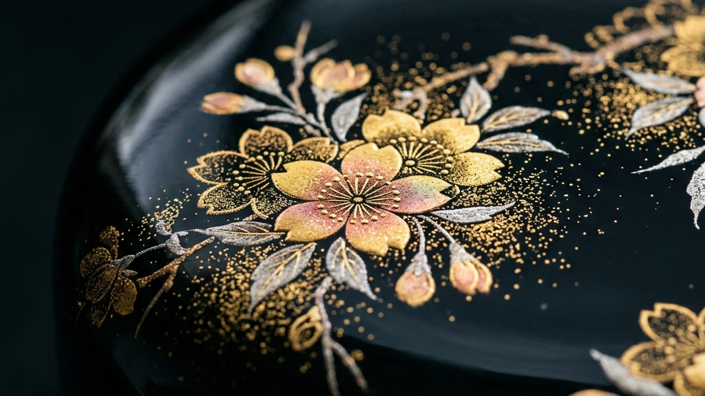</figure>

我々が日々接する均質化された量産品の群れの中で、ふと時間を止めるような絶対的な重力を持つ物体がある。それは往々にして、数百年の時を生き延びた技術の結晶である。江戸時代から続く静岡の郷土工芸「駿河蒔絵」。漆黒の闇に蒔かれた金銀の粉が描き出すのは、単なる美しい意匠ではなく、効率化の波に抗い続けた職人たちの無言の執念そのものだ。

    
【本稿で紐解く3つの核心】

    <ul>
        <li>文政11年を起点とする、信州から駿府へ持ち込まれた異端の系譜</li>
        <li>消粉と研出が証明する、ミクロの物理法則と色彩の暴力的な美しさ</li>
        <li>位牌から現代の装身具へ。用途を変えながらも貫かれる祈りの本質</li>
    </ul>

現在、JR静岡駅構内の「駿府楽市」にて開催されている展示会は、まさにその歴史的重力と直面する臨床現場である。5人の蒔絵師が持ち寄った150点に及ぶ手仕事の痕跡から、我々は何を読み取るべきか。失われつつある「本物」が持つ圧倒的な熱量と、その深遠なる知層の奥底へと足を踏み入れていきたい。

<h2>駿河蒔絵の異端性 信州の血脈が駿府で開花した極彩色の系譜</h2>
<figure class="wp-block-image">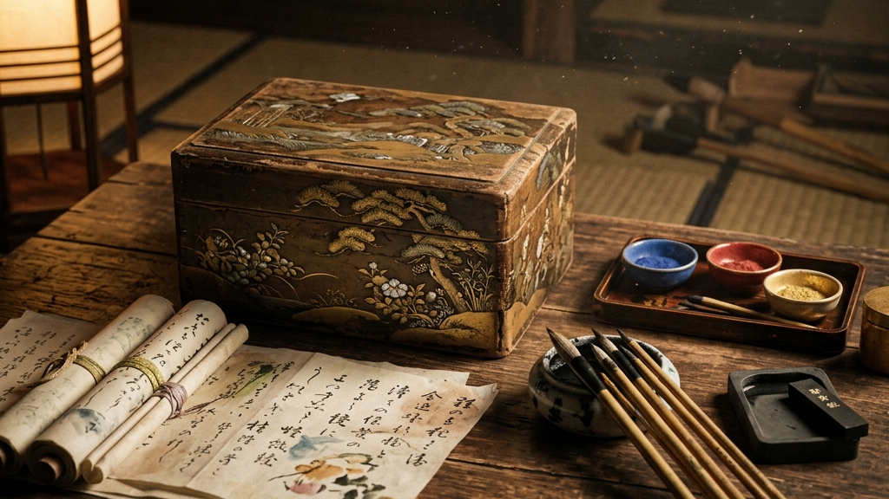</figure>

伝統工芸の多くは、その土地の風土から自然発生的に生まれる土着の文化として語られがちである。しかし、駿河蒔絵のルーツは極めて特異な「技術の移植」と「血脈の交差」にある。

時は江戸後期の文政11年（1828年）。駿府の塗師であった中川専蔵が、信州から訪れた画家の教えを乞い、独自の意匠を描き始めたことがその起源とされている。土着の漆塗り技術に、外部（信州）から持ち込まれた異質な美意識が衝突した瞬間である。これは、純血主義に陥りがちな伝統の世界において、極めて革新的なオープンイノベーションであったと言えるだろう。

<blockquote style="margin: 2em 0; padding: 2em; border-left: 1px solid #111; border-right: 1px solid #111; background-color: #fafafa; text-align: center;">
    
「異質な技術の衝突こそが、1000年を生き延びる強靭な突然変異を生む」

    <cite style="display: block; margin-top: 1em; font-size: 0.85em; color: #777;">— 伝統工芸における技術伝播の真理</cite>
</blockquote>

当時、漆器に金粉を蒔く技法そのものは京都や江戸（東京）でも盛んであったが、中川専蔵が確立したスタイルは、花鳥草木などの自然のモチーフを過剰なまでに華やかに、かつ写実的に描き出すというものであった。この「極彩色」と「写実性」への強いこだわりは、後に「駿河蒔絵」という確固たるアイデンティティを形成していく。

    
Core Principles

    <ul style="list-style: none; padding: 0; margin: 0; color: #333; line-height: 1.8;">
        <li style="border-bottom: 1px dotted #ccc; padding: 0.8em 0;">純血主義の打破：信州の画家と駿府の塗師の技術交差</li>
        <li style="border-bottom: 1px dotted #ccc; padding: 0.8em 0;">モチーフの具象化：花鳥草木を極彩色で写実的に描く圧倒的な表現力</li>
        <li style="padding-top: 0.8em;">技術の定着：漆という<a href="https://kakera.inc/heritage/274/" target="_blank" rel="noopener noreferrer" style="color:#bba078; text-decoration:none;">天然の接着剤がもたらす千年の構造証明</a></li>
    </ul>

興味深いのは、駿府という土地が持つ「徳川家康の隠居地」としての歴史的磁場である。全国から優秀な職人が集められ、技術が高度に集積していたこの地において、駿河蒔絵は単なる日用品の装飾を超え、権威の象徴、あるいは武家や豪商たちの美意識を顕現させるための極限のインターフェースとして磨き上げられていった。漆という天然の樹脂を用いて金銀を定着させる技術は、<a href="https://kakera.inc/curation/678/" target="_blank" rel="noopener noreferrer" style="color:#bba078; text-decoration:none;">永遠を繋ぐ手仕事としての「金」への渇望</a>と深く結びついている。

このように、駿河蒔絵の起源を探ることは、単なる歴史の年表をなぞることではない。それは、外部の血脈を飲み込み、自らの技術（漆塗り）と結合させることで、予測不能な進化を遂げた「美のサバイバル」の軌跡を追体験することに他ならない。それは、<a href="https://kakera.inc/curation/366/" target="_blank" rel="noopener noreferrer" style="color:#bba078; text-decoration:none;">時間を吸収する工芸が切り拓く新たな審美の地平</a>そのものであり、現代の我々が直面する、予測不可能なビジネスや社会の変革期においても、この「異端の受容」と「独自の昇華」のプロセスは、極めて重いインサイトを与えてくれるのだ。

<h2>駿河蒔絵を育んだ地政学 徳川家康の隠居と駿府の特異点</h2>
<figure class="wp-block-image">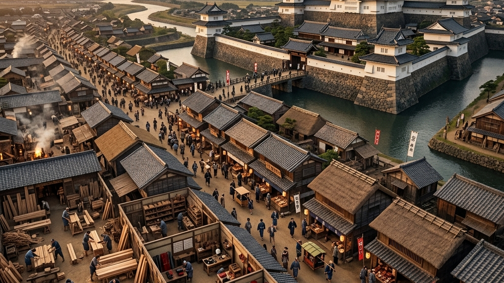</figure>

漆の物理法則に加えて、駿河蒔絵の成り立ちを理解する上で避けて通れないのが、「駿府（現在の静岡市）」という土地が持つ特異な地政学である。なぜ、京都や江戸（東京）ではなく、この地においてこれほどまでに高度で華やかな蒔絵技術が開花したのか。その答えは、一人の天下人と、彼が構想した都市計画の中にある。

慶長12年（1607年）、徳川家康は将軍職を秀忠に譲り、自らは大御所として駿府城へ移り住んだ。この「大御所政治」の開始により、駿府は実質的に日本の政治・文化の副都心としての機能を持つことになる。家康は駿府城の築城および城下町の整備にあたり、全国各地から優秀な大工、木工ロクロ師、漆塗師、そして蒔絵師を強制的に、あるいは破格の待遇で呼び集めた。これが静岡の伝統産業の巨大な源流である。

    

        ◆
        <strong style="display: block; font-size: 1em; margin-bottom: 0.2em; color: #333;">慶長年間：駿府城の築城と職人集積</strong>
        
全国から一流の職人が集められ、木工や漆塗りの巨大なインフラが構築された特異点。

    

    

        ◆
        <strong style="display: block; font-size: 1em; margin-bottom: 0.2em; color: #333;">文化・文政期：静岡浅間神社の造営</strong>
        
漆工や彫刻の技術がさらに洗練され、武家の威光を示す極彩色の装飾が求められた。

    

    

        ◆
        <strong style="display: block; font-size: 1em; margin-bottom: 0.2em; color: #333;">文政11年（1828年）：中川専蔵による駿河蒔絵の創始</strong>
        
蓄積された土着のインフラと、外部（信州）の異質な意匠が衝突し、新たな系譜が誕生。

    

さらに、19世紀初頭に行われた「静岡浅間神社（しずおかせんげんじんじゃ）」の造営事業は、駿府の職人たちにとって巨大な臨床実験の場となった。漆工や彫刻、絵師たちが競い合うように腕を振るい、極彩色で彩られた壮麗な社殿群が構築されていく。この「圧倒的な富と権力に裏打ちされた装飾性」への渇望が、駿河の地における漆器のスタンダードを異常なまでに引き上げていったのである。

文政11年に中川専蔵が信州の画家の技術を取り入れた際、彼が単なる模倣に終わらず、瞬く間に「駿河蒔絵」という独自の極彩色スタイルを確立できたのは、この駿府という土地に既に【極限の漆工インフラと美意識の地層】が形成されていたからに他ならない。イノベーションとは、何もない荒野からは生まれない。過去から蓄積された膨大な技術的・人的リソースの地層に、外部からの異質なノイズ（他産地の技術）が衝突した時にのみ発火するのだ。これは、現代の組織論やビジネスにおけるイノベーションの構造と完全に符合する事実である。

<h2>駿河蒔絵の物理法則 消粉と研出が証明する職人の沈黙</h2>
<figure class="wp-block-image">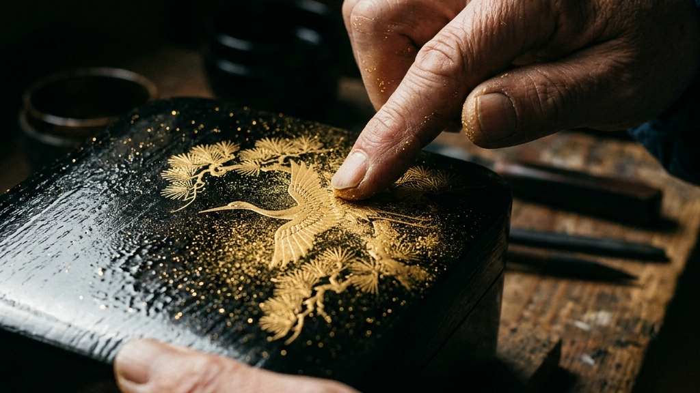</figure>

我々は完成された蒔絵の美しさに目を奪われがちだが、その背後にあるのは、極めて緻密で暴力的なまでの物理法則との闘いである。駿河蒔絵を特異なものたらしめているのは、単なる絵画的な表現力だけでなく、「消粉（けしふん）」や「研出（とぎだし）」といった、物質の限界に挑む臨床的なアプローチの集積である。

<dl style="margin: 2em 0; border-top: 2px solid #111;">
    <dt style="font-weight: bold; font-size: 1.1em; margin-top: 1.5em; color: #111;">消粉（けしふん）蒔絵</dt>
    <dd style="margin: 0.5em 0 1.5em 0; padding-left: 1.5em; border-left: 2px solid #bba078; color: #555;">金箔を極限まで細かく砕いたミクロの粉末（消粉）を用い、漆が乾く寸前の絶妙なタイミングで綿を使って擦り込む技法。息を吹きかけるだけで飛散するほどの微細な粒子を定着させる、静寂と緊張のプロセス。</dd>
    <dt style="font-weight: bold; font-size: 1.1em; margin-top: 1.5em; color: #111;">研出（とぎだし）蒔絵</dt>
    <dd style="margin: 0.5em 0 1.5em 0; padding-left: 1.5em; border-left: 2px solid #bba078; color: #555;">模様を蒔いた上から全体に漆を塗り重ね、完全に硬化した後に木炭等で表面を研ぎ出し、下の模様を平滑に浮かび上がらせる技法。空間を削り出し、隠された光を解放する破壊と再生の行為。</dd>
</dl>

特に「消粉蒔絵」は、駿河蒔絵の代名詞とも言える技法だ。純金を原子レベルに近い微粒子へと砕き、漆の粘度と乾燥速度を秒単位で見極めながら定着させていく。そこには、「絵を描く」という牧歌的な表現は存在しない。あるのは、漆の硬化反応と金属粉の比重をコントロールする、冷徹な化学者としての眼差しだけである。これは、同じくミクロの金属箔を定着させる<a href="https://kakera.inc/heritage/264/" target="_blank" rel="noopener noreferrer" style="color:#bba078; text-decoration:none;">西陣織の引箔が持つ至高の職人技</a>とも完全に構造を同一にしている。

一方、「研出蒔絵」はさらに泥臭い。一度完成した美しい文様の上から、あえて漆をベタ塗りに被せて完全に隠蔽する。そして数日間の硬化を待った後、今度は研磨用の木炭を用いて、漆の層をミクロン単位で削り落としていくのだ。削りすぎれば模様そのものが消滅し、削りが浅ければ模様は曇ったままである。指先の皮膚感覚だけを頼りに、見えない光を掘り起こすこの作業は、孤独な発掘作業に似ている。

<figure class="wp-block-table">
    <table style="width: 100%; border-collapse: collapse; text-align: left; font-size: 0.9em;">
        <thead>
            <tr>
                <th style="padding: 1.5em 1em; border-bottom: 1px solid #111; color: #111; font-weight: normal;">技法</th>
                <th style="padding: 1.5em 1em; border-bottom: 1px solid #111; color: #111; font-weight: normal;">物理的プロセス</th>
                <th style="padding: 1.5em 1em; border-bottom: 1px solid #111; color: #111; font-weight: normal;">もたらされる概念的特長</th>
            </tr>
        </thead>
        <tbody>
            <tr>
                <td style="padding: 1.5em 1em; border-bottom: 1px solid #eee; font-weight: bold;">消粉蒔絵</td>
                <td style="padding: 1.5em 1em; border-bottom: 1px solid #eee; color: #555;">微細金属粉の摩擦定着</td>
                <td style="padding: 1.5em 1em; border-bottom: 1px solid #eee; color: #555;">柔らかな反射と空間への溶け込み</td>
            </tr>
            <tr>
                <td style="padding: 1.5em 1em; border-bottom: 1px solid #eee; font-weight: bold;">研出蒔絵</td>
                <td style="padding: 1.5em 1em; border-bottom: 1px solid #eee; color: #555;">漆層の隠蔽と微視的研磨</td>
                <td style="padding: 1.5em 1em; border-bottom: 1px solid #eee; color: #555;">完全な平滑性と深淵からの発光</td>
            </tr>
        </tbody>
    </table>
</figure>

この二律背反するような物理的アプローチが、駿河蒔絵特有の「極彩色」を立体的に支えているのだ。光を乱反射する消粉の粒子と、深い漆の層の奥から発光する研出の平滑面。この光と影のレイヤーが重なり合うことで、<a href="https://kakera.inc/heritage/281/" target="_blank" rel="noopener noreferrer" style="color:#bba078; text-decoration:none;">螺鈿細工のナノ構造色が放つような圧倒的な奥行き</a>が生まれるのである。

ここで重要なのは、これらの過酷な物理法則と闘う職人たちが、決してその苦労を作品の表面にひけらかさないという点だ。彼らは徹底して沈黙する。完成した作品の美しさの裏に、どれほどの摩擦と非効率が隠されているか。しかし、その見えない執念こそが、量産品には絶対に宿らない「重力」を生み出す。効率化がすべてを覆い尽くす現代において、この狂気とも言える「沈黙の手仕事」は、我々の薄っぺらいタイパ至上主義に対する強烈なアンチテーゼとして機能しているのだ。

<h2>駿河蒔絵を支配する漆の物理法則 酵素酸化がもたらす逆説的な硬化プロセス</h2>
<figure class="wp-block-image">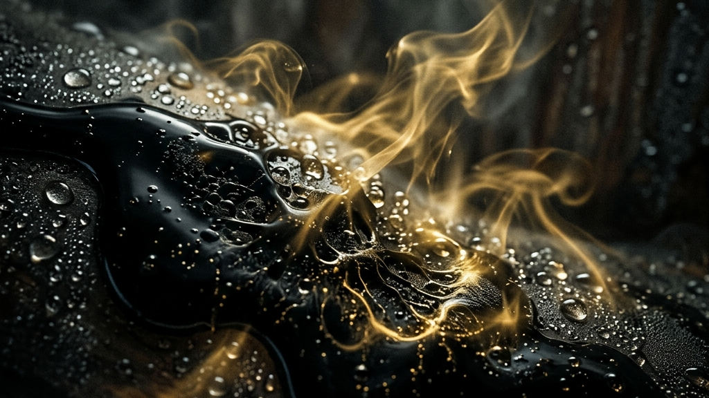</figure>

駿河蒔絵における「消粉」や「研出」といった極限の技法を可能にしているのは、職人の手先の器用さだけではない。その根底には、「漆（うるし）」という極めて特異な天然樹脂の物理法則に対する、畏敬の念と完全なる服従がある。漆は単なる塗料ではない。それは、空気中の水分を取り込んで自らを硬化させる、生きた化学物質である。

一般的な塗料は、溶剤が空気中に揮発することで「乾燥」する。しかし、漆の主成分である「ウルシオール」は全く異なるメカニズムを持つ。漆の中に含まれる酵素「ラッカーゼ」が、空気中の水分（酸素）を取り込むことで酸化重合を起こし、強固なポリマー（高分子化合物）へと変化するのだ。つまり、漆は「乾く」のではなく「固まる」のである。この酵素反応を引き起こすためには、温度20〜25度、湿度70〜80%という、まるで熱帯雨林のような特殊な環境（室＝むろ）が不可欠となる。

<blockquote style="margin: 2em 0; padding: 2em; border-left: 1px solid #111; border-right: 1px solid #111; background-color: #fafafa; text-align: center;">
    
「水分を奪うのではなく、水分を吸収して自らを強固な鎧へと変える。漆の硬化は、自然界が仕組んだ最も美しい逆説である」

    <cite style="display: block; margin-top: 1em; font-size: 0.85em; color: #777;">— 天然樹脂の化学構造に関するインサイト</cite>
</blockquote>

駿河蒔絵の職人たちは、このミクロの酵素反応を皮膚感覚で読み取っている。湿度が高すぎれば反応が急激に進んで表面だけが硬化し、内部が液状のままになる「縮み」を引き起こす。逆に湿度が低すぎれば、いつまで経っても金粉を定着させることができない。消粉を蒔くその一瞬のタイミングは、デジタル時計や温度計で測れるものではない。<a href="https://kakera.inc/heritage/274/" target="_blank" rel="noopener noreferrer" style="color:#bba078; text-decoration:none;">西陣織の引箔にも用いられる漆の強力な定着技術</a>は、職人が自身の五感を研ぎ澄ませ、漆という生物の呼吸と完全に同調した時にのみ発動するのだ。

    
Urushi Curing Process

    <ul style="list-style: none; padding: 0; margin: 0; color: #333; line-height: 1.8;">
        <li style="border-bottom: 1px dotted #ccc; padding: 0.8em 0;">揮発ではなく吸収：水分を取り込むことで発動する酵素酸化（ラッカーゼの働き）</li>
        <li style="border-bottom: 1px dotted #ccc; padding: 0.8em 0;">環境依存性：温度20〜25度、湿度70〜80%という極めて狭い最適閾値</li>
        <li style="padding-top: 0.8em;">時間との闘い：完全硬化までに数日から数ヶ月を要する、非効率の極み</li>
    </ul>

このように、駿河蒔絵の制作現場は、牧歌的なアトリエというよりも、厳密な環境制御が求められる「臨床現場」に近い。効率化やスピードアップといった現代のビジネスロジックは、漆の分子構造の前では一切通用しないのである。職人たちは、人間の都合ではなく、漆の都合に合わせて自らの時間を差し出す。この圧倒的な非効率性と、自然法則への完全な服従こそが、1000年先の未来まで金粉を定着させる「重力」の正体なのだ。

<h2>駿河蒔絵を支えるエコシステムの脆弱性 国産漆の枯渇とサプライチェーンの真実</h2>
<figure class="wp-block-image">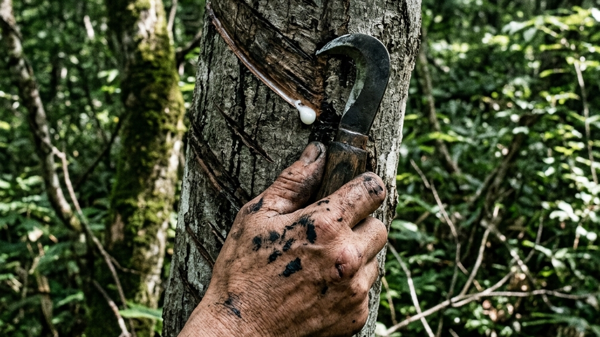</figure>

我々は、目の前にある完成された駿河蒔絵の美しさに感嘆の声を上げる。しかし、その輝きを根底で支えている「サプライチェーン（供給網）」の泥臭い危機的状況について、思いを馳せる者はどれほどいるだろうか。蒔絵の存続は、職人の技術伝承だけで完結するものではない。それは、漆という天然資源のエコシステムと完全に一蓮托生の関係にある。

驚くべき事実がある。現在、日本国内で消費される漆のうち、純粋な「国産漆（浄法寺漆など）」が占める割合はわずか数パーセントに過ぎない。残りの90%以上は中国などからの輸入に依存しているのが現実だ。かつては全国各地に「漆掻き（うるしかき）」と呼ばれる職人が存在し、漆の木から一滴一滴、樹液を採取して歩いた。しかし、1本の漆の木から採取できる樹液は、10年以上育てた木であってもわずか200グラム程度（牛乳瓶1本分）である。この絶望的なまでの採取効率の悪さと、過酷な労働環境、そして安価な輸入漆の台頭により、国産漆のサプライチェーンは崩壊の危機に瀕しているのだ。

<blockquote style="margin: 2em 0; padding: 2em; border-left: 1px solid #111; border-right: 1px solid #111; background-color: #fafafa; text-align: center;">
    
「表面の極彩色は、足元の泥沼のようなサプライチェーンによって支えられている」

    <cite style="display: block; margin-top: 1em; font-size: 0.85em; color: #777;">— 伝統工芸のエコシステムが抱える矛盾</cite>
</blockquote>

蒔絵に不可欠な「金粉」や「銀粉」の製造、筆を作るための特殊な獣毛（ネズミや猫の毛）、さらには木地（素地）を削り出すロクロ師の存在。駿河蒔絵という一つのプロダクトは、こうした何十もの専門的な素材と道具のサプライチェーンが、奇跡的なバランスで噛み合って初めて成立する。そのどれか一つ、例えば「漆掻き職人」が一人引退するだけで、全体の生産ラインが完全にストップしてしまうという、極めて脆いエコシステムの上に成り立っているのである。

この事実を知った時、駿河蒔絵の価格を「高い」と批判することはもはや不可能になる。我々が支払う対価は、単なる美しい装飾品への代金ではない。それは、崩壊寸前の国産漆のエコシステムを延命させ、関連するすべての職人たちの明日をつなぐための「防波堤の維持費」なのだ。<a href="https://kakera.inc/curation/1450/" target="_blank" rel="noopener noreferrer" style="color:#bba078; text-decoration:none;">有田焼の天草陶石が直面する枯渇問題</a>と同様に、素材供給の脆弱性という不都合な真実から目を背けたままでは、真の意味で伝統工芸を所有することはできない。

<h2>駿河蒔絵の現在地 位牌から装身具へ宿る祈りの変遷</h2>
<figure class="wp-block-image">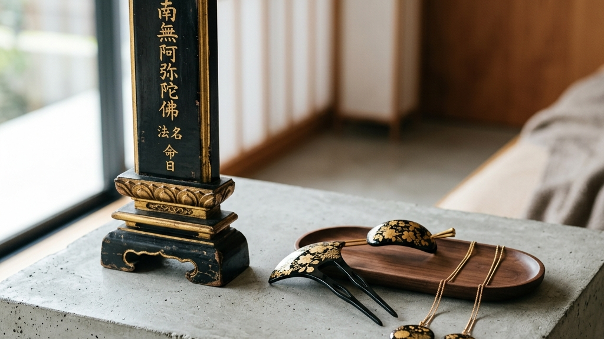</figure>

技術がいかに高度であっても、それが現代の生活から遊離してしまえば、工芸は単なる博物館の収蔵品へと堕落する。駿河蒔絵が今日まで生き延びてきた最大の理由は、その用途を時代に合わせて冷徹に変容させてきた「生存戦略」にある。

歴史を紐解けば、静岡（駿府）はかつて木工ろくろや漆器の一大産地であり、特に仏具や位牌（いはい）の製造において全国的なシェアを誇っていた。死者を弔い、先祖と対話するためのインターフェースである位牌。その漆黒の表面に、永遠不変の輝きを放つ金粉で戒名を記す行為は、単なる装飾ではなく「祈り」の物質化そのものであった。駿河蒔絵の職人たちは、この祈りの重さを誰よりも熟知していたはずだ。

    祈りの形が変われど、 それに宿る熱量は決して目減りしない。

しかし現代において、巨大な仏壇や重厚な位牌を置く家庭は激減している。この不可逆なライフスタイルの変化に対し、駿河蒔絵は「祈りのスケールダウン」という極めて高度な適応を見せた。それが、現在主流となりつつあるアクセサリーや小物への展開である。

ヒマワリや桜を模した髪留め、日常使いの文箱、あるいはペンダントトップ。一見すると、荘厳な仏具からカジュアルな装身具への「格下げ」に見えるかもしれない。しかし、そのミクロな表面に施されているのは、紛れもなくあの「消粉」や「研出」という狂気の手仕事である。職人たちは、用途を小さくした分、その限られた表面積に対して圧倒的な密度の技術を注ぎ込んでいるのだ。これは<a href="https://kakera.inc/curation/561/" target="_blank" rel="noopener noreferrer" style="color:#bba078; text-decoration:none;">伝統と現代が交差する知層</a>を体現する見事な戦略である。

装身具として駿河蒔絵を身に纏うこと。それは、かつて位牌に込められていた「永遠への祈り」を、極小のポータブルな形で日常へ持ち出すことに他ならない。用途が変わっても、そこに込められた職人の沈黙と熱量は何も変わっていない。駿河蒔絵の現在地は、変化を恐れず本質だけを残すという、最も過酷で美しい生存の形を我々に提示している。

<h2>駿河蒔絵のアノニマスな強度 無名性が現代アート市場に突きつける問い</h2>
<figure class="wp-block-image">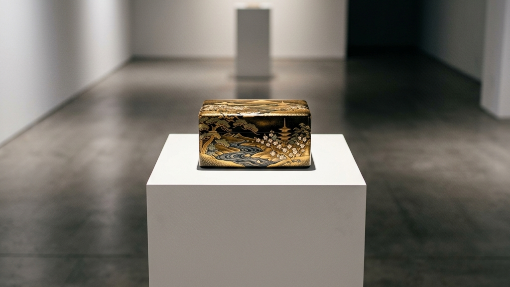</figure>

現代の西洋的なアート市場において、作品の価値を決定づける最大の要素は「誰が作ったか（作家性）」である。キャンバスの右下には必ず自己主張としてのサインが刻まれ、アーティストの強烈なエゴが価格を牽引する。しかし、駿河蒔絵をはじめとする日本の伝統工芸品の多くは、意図的に「アノニマス（無名性）」を貫いてきた。

位牌や文箱、髪留めに至るまで、そこには蒔絵師の自己顕示欲を満たすような巨大なサインは見当たらない。職人たちは、徹底して「用（実用）」に奉仕し、自らの存在を極彩色の意匠の裏側へと消し去ってきた。これは、彼らが自身の技術を卑下していたからではない。むしろ、「使用者の人生に溶け込むこと」こそが究極の美であるという、極めて高度な引き算の美学の表れである。<a href="https://kakera.inc/curation/366/" target="_blank" rel="noopener noreferrer" style="color:#bba078; text-decoration:none;">アノニマスの痕跡と不完全なる美</a>は、所有者自身がその余白に自らの記憶を書き込むことを許容するのだ。

<dl style="margin: 2em 0; border-top: 2px solid #111;">
    <dt style="font-weight: bold; font-size: 1.1em; margin-top: 1.5em; color: #111;">アート（西洋的パラダイム）</dt>
    <dd style="margin: 0.5em 0 1.5em 0; padding-left: 1.5em; border-left: 2px solid #bba078; color: #555;">作家の「個」と「エゴ」の表現。鑑賞者に対してメッセージを一方的に放射し、所有すること自体がステータスとなる。</dd>
    <dt style="font-weight: bold; font-size: 1.1em; margin-top: 1.5em; color: #111;">工芸的強度（駿河蒔絵のアノニマス性）</dt>
    <dd style="margin: 0.5em 0 1.5em 0; padding-left: 1.5em; border-left: 2px solid #bba078; color: #555;">職人の「個」の消去。圧倒的な技術を背景にしながらも沈黙し、使用者の日常と摩擦を起こしながら共に経年変化していく。</dd>
</dl>

興味深いのは、近年、この「作家性を消し去ったアノニマスな工芸的強度」が、海外の巨大なアート市場（アート・バーゼル等）において、逆説的に高く評価され始めていることだ。投機的なマネーゲームに組み込まれ、意味のない自己主張ばかりが肥大化した現代アートの狂騒に疲弊したコレクターたちが、いま、一切の作為を持たずただ静かにそこにある「工芸の沈黙」に、次なるパラダイムシフトを見出しているのである。

駿河蒔絵が放つ重力は、まさにこの「沈黙」から発せられている。金粉を蒔き、漆を研ぎ出すという狂気的な手仕事を完遂しながらも、最後に自らの名前を消し去るという美学。それは、過剰な自己アピール（SNS等での承認欲求）が蔓延する現代社会に対する、最も静かで、最も痛烈なカウンターパンチとして機能している。

<h2>「一生モノ」の代償 駿河蒔絵が突きつける摩擦とデメリットの受容</h2>
<figure class="wp-block-image">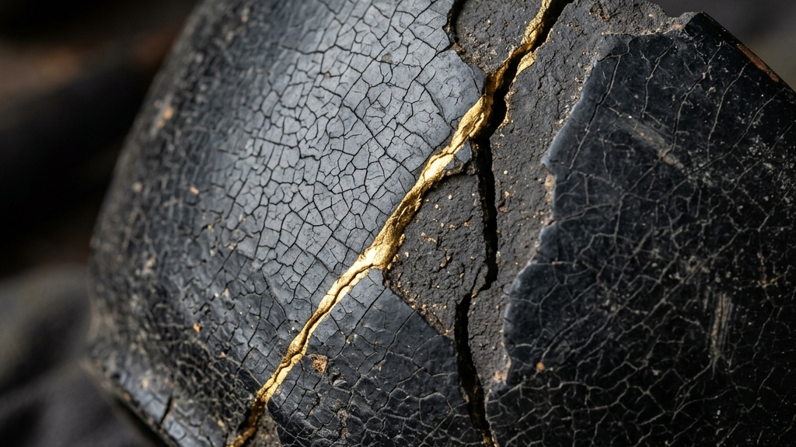</figure>

我々は「伝統工芸」や「一生モノ」という言葉を、無意識のうちに「メンテナンスフリーで永遠に美しいもの」と誤解しがちである。しかし、駿河蒔絵の真実を知るためには、その美しい金粉のベールの裏側に隠された、残酷なまでの物理的制約とデメリットを直視しなければならない。

漆器は、決して万能の素材ではない。

強固なポリマーとして硬化した漆であっても、その最大の弱点は「紫外線」と「極端な乾燥」である。直射日光に長時間晒されれば、分子構造が破壊されて白濁し、表面の艶は失われる。また、現代のエアコンが効きすぎた乾燥した室内は、適度な水分を必要とする漆にとって過酷な環境であり、木地の収縮を引き起こしてヒビ割れの原因となる。当然ながら、電子レンジでの加熱や食器洗い乾燥機の熱湯と強力な洗剤は、駿河蒔絵に対する明確な破壊行為に他ならない。

<dl style="margin: 2em 0; border-top: 2px solid #111;">
    <dt style="font-weight: bold; font-size: 1.1em; margin-top: 1.5em; color: #111;">紫外線による分子構造の破壊</dt>
    <dd style="margin: 0.5em 0 1.5em 0; padding-left: 1.5em; border-left: 2px solid #bba078; color: #555;">漆の主成分は紫外線によって劣化しやすく、透明感や強度が失われる。窓際での長期間の展示や保管は致命的なダメージを招く。</dd>
    <dt style="font-weight: bold; font-size: 1.1em; margin-top: 1.5em; color: #111;">急激な温度・湿度変化への脆弱性</dt>
    <dd style="margin: 0.5em 0 1.5em 0; padding-left: 1.5em; border-left: 2px solid #bba078; color: #555;">内部の木地（素地）が呼吸するため、極端な乾燥や直火・熱湯は素地の変形と漆の剥離を引き起こす。</dd>
</dl>

これらのデメリットを前にして、多くの現代人は「不便だ」「扱いづらい」と敬遠するかもしれない。タイパやコスパを至上命題とする現代社会において、これほど手のかかるプロダクトは明らかに異端である。しかし、この「摩擦」こそが、駿河蒔絵を真の「一生モノ」へと昇華させる重要な鍵なのだ。

傷つき、劣化し、ひび割れた時、駿河蒔絵は終わりではない。<a href="https://kakera.inc/curation/838/" target="_blank" rel="noopener noreferrer" style="color:#bba078; text-decoration:none;">金継ぎによる再生の工芸美</a>や、<a href="https://kakera.inc/curation/1154/" target="_blank" rel="noopener noreferrer" style="color:#bba078; text-decoration:none;">職人による塗り直しという臨床と蘇生</a>のプロセスを経て、傷跡すらも新たな景色として取り込み、より強靭な存在へとアップデートされていく。所有者は、この面倒なメンテナンスや修復の手間を引き受けることで、初めてそのプロダクトと「関係性」を結ぶことができるのである。

駿河蒔絵を所有するということは、利便性をお金で買う消費行動ではない。それは、職人が数ヶ月かけて挑んだ物理法則との闘いの痕跡を預かり、自らの生活の中でその脆弱性（デメリット）を守り抜くという、重い責任（コミットメント）を引き受けることである。波風の立たない便利な生活の中では、決して「執念」や「愛着」は育たない。あえて不便で手のかかるものと向き合い、摩擦を受け入れること。その泥臭い覚悟の中でしか、我々の心は本質的な豊かさに到達できないのだ。

<h2>駿河蒔絵の継承が抱える不条理 「10年の修行」が鍛え上げる思考体力</h2>
<figure class="wp-block-image">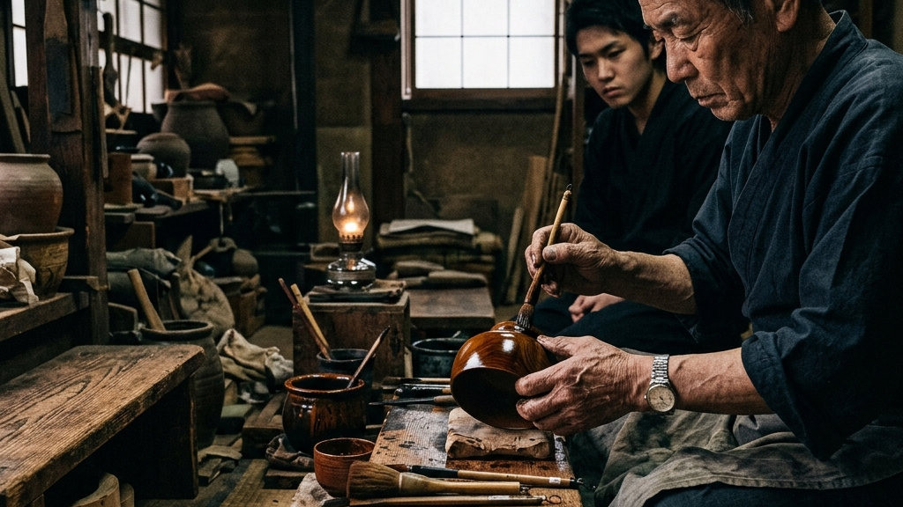</figure>

我々はビジネスの世界において、「効率化」と「マニュアル化」を無条件の善として崇拝している。OJTは数ヶ月で完了し、誰もが即戦力となるための合理的なカリキュラムが組まれる。しかし、駿河蒔絵の職人を育成する世界において、そのような薄っぺらいタイムパフォーマンの論理は一切通用しない。そこにあるのは、「10年の修行（下積み）」という、現代の常識から見れば完全なる不条理である。

蒔絵の技術は、YouTubeの動画を見たり、マニュアルを読んだりして身につくものではない。漆の粘度、その日の湿度、金粉の重さ。これらはすべて言語化不可能な「暗黙知」である。弟子は師匠の工房に入り、最初の数年は筆を握ることすら許されず、ただ道具の手入れや掃除、漆の精製といった泥臭い周辺作業を反復する。なぜ、このような非効率なプロセスが何百年も維持されているのだろうか。

それは、技術を教えるためではなく、「思考体力」と「狂気」を後天的にインストールするためである。

思い通りにならない漆という自然物と格闘し、失敗すれば数ヶ月の工程がすべて水泡に帰す。その絶望的なプレッシャーの中で、逃げ出さずに最後まで向き合い続けるためには、小手先の技術よりも「強靭な精神の土台」が不可欠となる。10年という不条理な下積みの時間は、効率よく正解にたどり着くためのものではない。理不尽な摩擦や、思い通りにならない余白をフラットに受け入れ、それでも前に進むための「覚悟」を醸成するための装置なのだ。

    

        ◆
        <strong style="display: block; font-size: 1em; margin-bottom: 0.2em; color: #333;">現代のマネジメント（波風の立たない優しさ）</strong>
        
最短距離で正解を与え、失敗を回避させる。結果として、予期せぬトラブルに直面した際に崩壊する脆弱な組織を生む。

    

    

        ◆
        <strong style="display: block; font-size: 1em; margin-bottom: 0.2em; color: #333;">職人の徒弟制度（逃げ場のない摩擦）</strong>
        
あえて正解を教えず、圧倒的な負荷と理不尽な時間を耐え抜かせることで、自ら本質を掴み取る強靭な個を鍛え上げる。

    

相手が傷つくリスクを極度に恐れ、「心理的安全性」という言葉に逃げ込んで摩擦を回避する現代の組織論。しかし、本当に波風の立たない優しさだけで、人は、あるいは組織は強くなるのだろうか。駿河蒔絵が1000年先まで残る強度を持っているのは、この逃げ場のない極限のプレッシャー（強烈な摩擦）の中でしか伝承されない執念があるからだ。我々は、この古臭いとされる「徒弟制度」の中にこそ、変化の激しい現代ビジネスを生き抜くための、最も本質的なコンテキストマネジメントの真髄を見出すべきなのである。

<h2>駿河蒔絵の臨床現場 駿府楽市で直面する150の手仕事</h2>
<figure class="wp-block-image">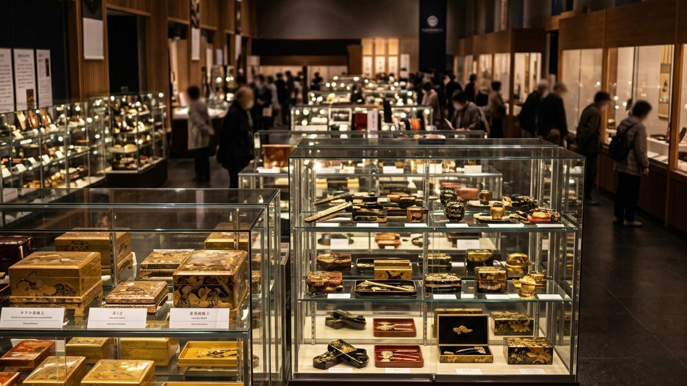</figure>

文政11年からの歴史、消粉と研出の物理法則、そして位牌から装身具への祈りの変遷。これらの知層をインプットした上で、我々は再び現在開催中の展示会へと視線を戻す必要がある。

現在、JR静岡駅構内の「駿府楽市」で開催されている展示会（2026年5月10日まで）には、5人の蒔絵師による約150点もの作品が並んでいる。富士山が精緻に描かれた文箱から、日常を彩るヒマワリの髪留めまで、そこにあるのは単なる商品の陳列ではない。数百年の時間を生き延び、現代の空間へ適応しようともがく「伝統工芸の生存証明」そのものである。

ガラスケース越しに作品を眺めるだけでは不十分だ。

その漆黒の奥から発光する金の粒子一つ一つに、どれほどの摩擦と、孤独な研磨の時間が費やされているのか。その背景にある職人の沈黙を想像した時、目の前にある小さな髪留めは、全く異なる重力を持って我々に迫ってくるはずだ。均質化され、タイパで消費される現代社会において、この「圧倒的な手仕事の痕跡」に直面すること自体が、一つの強烈なノイズ（摩擦）となる。

我々は、この摩擦を意図的に生活へ取り入れるべきである。効率だけを追い求めるシステムの中で、あえて「時間を吸収する工芸」を手元に置くこと。それは、流されていく日常に対する小さな、しかし確実な防波堤となるだろう。

<strong>Reference:</strong> <a href="https://news.google.com/rss/articles/CBMif0FVX3lxTE9USThUSk00UTRiaVI3RzloQVIxbXphOWU3VjVZbDdCTE56djNYWU9KOVdKZGloczJIQS0ybTY2TGdHTEJFLVgyT2hVRjVYY280bEpEbTJzV1AxcmhOSDlHTXFHUDhQR08xNlU2TUM1X1h6VTQ2S01KRVd3aF9ENHc?oc=5" target="_blank" rel="noopener noreferrer" style="color: #bba078;">職人技光る駿河蒔絵の展示会 江戸時代からの伝統工芸（テレビ静岡NEWS） - Yahoo!ニュース</a>

伝統を身に纏い、1,000年先の未来へ遺す。Kakeraが織り上げる西陣織アロハシャツの哲学と私たちの物語は、<a href="https://kakera.inc/concept/" target="_blank" rel="noopener">CONCEPT</a>、<a href="https://kakera.inc/kakera-aloha/" target="_blank" rel="noopener">Kakera Aloha</a>、および<a href="https://kakera.inc/about/" target="_blank" rel="noopener">ABOUT</a>よりご覧いただけます。

